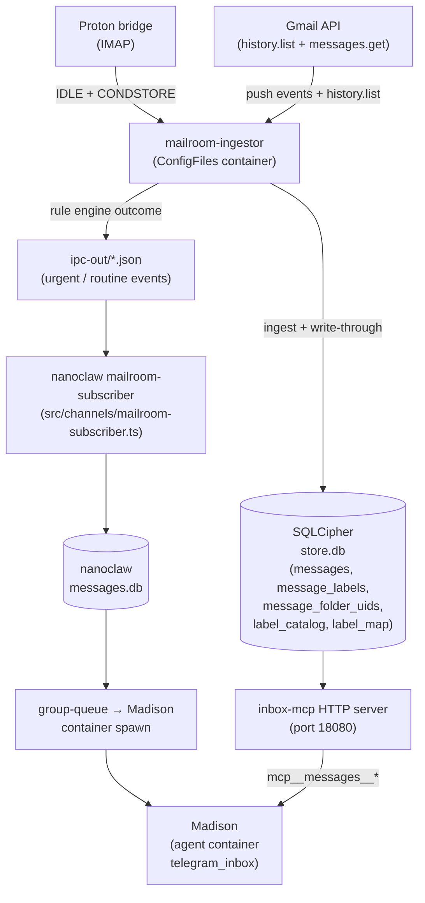

# Madison Inbox Mirror Architecture

Full DB mirror of upstream mailbox state across Gmail and Proton, enabling Madison to answer inbox-state questions that a content-only archive cannot. Graduate from `lode/plans/active/2026-04-madison-read-power/findings.md`.

## Mirror data model

### Identity

| Decision | Rationale |
|---|---|
| Dedup key: RFC-822 `Message-ID` | Single cross-source identity. Already used as `source_message_id` for Proton rows. Gmail rows get `rfc822_message_id` backfilled during hydration. |
| Same logical message stored as separate rows per account | Per-account state is real — archiving on Gmail ≠ archiving on Proton. Grouping is query-time (`GROUP BY rfc822_message_id`). |
| Synthetic fallback: `sha256(sender + received_at_ms + subject + body_size)` when Message-ID absent | Rare. Log when invoked. |
| Proton physical location tracked in `message_folder_uids(message_id, folder, uid)` | Replaces per-write IMAP search. Fixes Labels/*-unreachable v1 limitation in `apply_action.ts`. |

### Schema additions (Wave 1)

New columns on `messages`:

| Column | Type | Purpose |
|---|---|---|
| `rfc822_message_id` | TEXT | Cross-source identity key (backfilled for Proton; hydrated for Gmail) |
| `direction` | TEXT | `'received'` \| `'sent'` — derived from source state at ingest |
| `archived_at` | TEXT | ISO 8601 — set when Gmail INBOX label absent or Proton moves to Archive |
| `deleted_at` | TEXT | ISO 8601 — set on Trash event or inferred from missing upstream |
| `deleted_inferred` | INTEGER | 1 = row absent from all upstream folders at full-walk time |

New tables:

- **`message_labels(message_id, label, canonical, source_id)`** — Gmail `labelIds` + Proton folder paths. Written at ingest, kept in sync by write-through and reconcile.
- **`message_folder_uids(message_id, folder, uid)`** — Proton only. Enables UID-direct write without per-write IMAP search.
- **`label_catalog(account_id, label, canonical, source_id, system)`** — unique labels per account. Populated at ingest + hydration; updated on rename.
- **`label_map(canonical, account_id, label)`** — user-curated cross-account equivalence. Enables `canonical_label` expansion in `query`.

### Label semantics

| Decision | Rationale |
|---|---|
| `label_catalog` keyed on `source_id` (Gmail labelId / Proton folder path) | Gmail renames preserve labelId; free rename support |
| Gmail system labels extracted to typed columns (`INBOX` → `archived_at`, `TRASH` → `deleted_at`, `SENT`/`DRAFT`/`SPAM` → `direction`) | Structural state deserves columns; labels are for user concepts |
| Remaining Gmail labels (`STARRED`, `IMPORTANT`, `CATEGORY_*`) stored in `label_catalog` with `system=1` | Still queryable; distinguished from user labels |
| Proton folder paths stored as labels | Proton's folder model is label-equivalent for query purposes |
| Per-account storage + optional user-curated `label_map` | Accounts are genuinely independent; map is a queryable fact, not a storage merge |
| Canonicalization: NFC normalize → strip zero-width chars → strip `Labels/` prefix → trim + collapse whitespace → Unicode case-fold | Consistent match at ingest, hydration, and `label_map` insert |

### Message classes

| Decision | Rationale |
|---|---|
| Ingest received + sent mail; `direction` column discriminates | Thread reconstruction needs sent mail; default filter keeps inbox views clean |
| Skip drafts at ingest; purge existing | Mutable content, not a triage surface |
| Skip spam at ingest; purge existing | Noise + phishing surface; default-exclude would need to be everywhere |
| `thread` tool ignores direction filter | Threads are intrinsically bidirectional |

### Default filter convention

All read tools apply `direction = 'received' AND deleted_at IS NULL` by default:
- `search`, `recent`, `query` — pass `include_sent: true` or `include_deleted: true` to opt out
- `thread` — direction-agnostic (shows full thread); `include_deleted` opt-out available

## Session-hash pattern

### Problem

NanoClaw persists `sessionId` per group and resumes the conversation on every spawn. When the MCP tool list changes (new tool registered, old tool removed), the model's in-context self-image stays anchored to the prior toolset because models heavily weight conversation history over fresh system prompts.

### Solution (Wave 2E — NC `c6cdd3a`)

1. `sessions` table gains `tool_list_hash TEXT` column.
2. On spawn, compute SHA-256 of current MCP server config per group (sorted server names from the group's effective config; host-side derivation — no live network query).
3. If stored hash differs from computed hash → `DELETE FROM sessions WHERE group_folder = ?`. Next spawn starts fresh with the new tool set fully visible.
4. NULL on existing session (pre-migration row) also triggers a clear.
5. Hash mismatch logged at INFO level with old and new hash values.

**Codex P2 caveat (deferred):** Trawl config changes that don't add/remove the Trawl MCP server itself are not yet caught by the hash. Hash covers server presence, not server config content. Tracked as deferred item in the plan.

**Manual fallback** (until a structural fix was shipped): `sqlite3 ~/containers/data/NanoClaw/store/messages.db "DELETE FROM sessions WHERE group_folder = 'telegram_inbox'"`. Still available as an emergency clear.

## Data flow

## Hydration and reconcile

### Principle

**Hydration ≡ reconcile's full-walk mode.** The migration script (`scripts/migrate-mirror.ts`) calls `runFullHydration()` — exactly the same function the nightly reconcile calls. First invocation IS the migration; subsequent calls are idempotent re-runs.

### Hydration phases

1. **Open + schema guard** — refuse reinit if `store.db` exists but decryption fails (`MailroomDbDecryptError`).
2. **Schema migration** — add new columns + tables if not present; set `schema_version='2'` sentinel.
3. **Purge** — delete draft + spam rows.
4. **rfc822 backfill** — `UPDATE messages SET rfc822_message_id = source_message_id WHERE source='protonmail'` (already the RFC-822 ID). Gmail rows hydrated by walker.
5. **`runFullHydration`** — Proton folder walker + Gmail label walker → delta builder → apply phase (INSERT OR IGNORE for adds; re-verify before removes).
6. **Inferred deletes** — rows absent from all upstream folders → `deleted_at = NOW()`, `deleted_inferred = 1`.
7. **Self-audit** — queries actual DB state; fails `exit 1` if reported metrics drift from actual or invariants break.

### Self-audit invariants

- If Proton messages exist → `message_labels` must be non-empty.
- If adds were reported → `label_catalog` must be non-empty.
- `deleted_inferred > 50%` of total = blast guard; abort.
- Metric counters verified against raw `SELECT COUNT(*)` on each table.

### Migration results (2026-04-23 live run)

| Table / Column | Value |
|---|---|
| `messages.rfc822_message_id` NOT NULL | 59,673 |
| `message_labels` rows | 192,080 total (190,296 Proton + 1,784 Gmail) |
| `message_folder_uids` rows | 190,296 |
| `label_catalog` rows | 175 (147 Proton folders + 28 Gmail labels) |
| `messages.deleted_inferred=1` | 51 (0.08% — well under blast guard) |
| Total messages | 60,166 |
| Wall time | 9.7 min |

## Concurrency

| Decision | Rationale |
|---|---|
| SQLite WAL + idempotent writes; no explicit mutex | Set ops commute; SQLite serializes writers |
| Reconcile apply phase only removes after upstream re-verify | Prevents races with concurrent write-throughs |
| Batch tools retry on `SQLITE_BUSY` per-item (3×, 50/100/200ms) | Don't fail whole batch on transient lock |

## Related

- [infrastructure/mailroom-mirror.md](../infrastructure/mailroom-mirror.md) — sync worker details (history.list, IDLE+CONDSTORE, reconcile scheduler)
- [infrastructure/madison-pipeline.md](../infrastructure/madison-pipeline.md) — push-driven event delivery (ingestor → subscriber → group queue → Madison)
- [infrastructure/mailroom-rules.md](../infrastructure/mailroom-rules.md) — rule engine + deploy operational notes
- Plan: `lode/plans/active/2026-04-madison-read-power/tracker.md`
