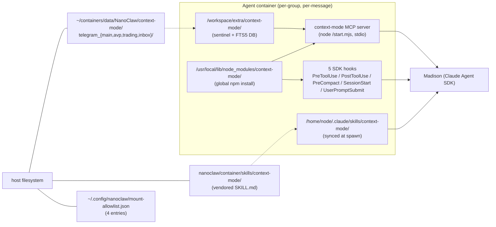

# Context-Mode Integration

NanoClaw's agent containers run with the [`context-mode`](https://github.com/mksglu/context-mode) MCP plugin installed globally, wired into the Claude Agent SDK via hooks plus a vendored skill. Context-mode is a **context-compression layer** that sits between the LLM and its tool calls — tool outputs get sandboxed into an FTS5 knowledge base instead of flooding the context window. Applied across all four groups.

## What it does

Three independent mechanisms:

1. **Sandboxed subprocess execution.** The model calls `mcp__context-mode__ctx_execute` / `ctx_execute_file` instead of raw `Bash` / `Read` / `Grep` for data-processing tasks. The sandbox runs shell/JavaScript/Python scripts and **only explicit `console.log()` / `print()` output reaches the LLM**. Raw tool output stays in the sandbox. Upstream claim: 315 KB → 5.4 KB (98% reduction) on typical flows.

2. **FTS5 / BM25 knowledge base.** `ctx_fetch_and_index` pulls a URL, chunks, indexes. `ctx_search(queries: [...])` returns only BM25-ranked relevant chunks. Used for web docs and any content needing multi-query access without paying the full load each time.

3. **Session continuity.** `PostToolUse` hooks record tool outputs to a per-session SQLite FTS5 DB. `PreCompact` snapshots state before compaction. `SessionStart` hydrates relevant past events via BM25 rather than dumping everything back.

## Where the pieces live



## Opt-in mechanism

Mount-sentinel, mirroring a-mem. If `/workspace/extra/context-mode/` exists inside the container (via a per-group bind-mount), the agent-runner enables context-mode:

- Registers `context-mode` MCP server in `mcpServers`
- Adds `mcp__context-mode__*` to `allowedTools`
- Wires all 5 hook types via `createContextModeHook(scriptName)` factory
- Logs `[agent-runner] context-mode: enabled`

If the mount is absent, context-mode is fully skipped and the session runs as before. Per-group enable is via `additionalMounts[]` in the group's `container_config`; applied uniformly via `scripts/group-config.ts context-mode-defaults <folder>`.

## Host data layout

Per-group FTS5 databases live on the host at:

```
~/containers/data/NanoClaw/context-mode/
├── telegram_avp/      ← AVP group's per-session FTS5 DBs
├── telegram_main/
├── telegram_trading/
└── telegram_inbox/
```

Regular directories (not BTRFS subvolumes) under the `NanoClaw/` parent subvolume. Inherit the hourly snapshot rotation automatically. Ownership `jeff:jeff`, mode `2775`.

## Path resolution in agent-runner

Context-mode is installed globally via `npm install -g context-mode`. The agent-runner locates the install dir at runtime via:

```typescript
const searchPaths = createRequire(import.meta.url).resolve.paths('context-mode') ?? [];
for (const searchDir of searchPaths) {
  const candidate = path.join(searchDir, 'context-mode');
  if (fs.existsSync(path.join(candidate, 'package.json'))) return candidate;
}
```

Walking `require.resolve.paths` rather than `require.resolve('pkg/package.json')` — the latter is blocked by Node 22's strict `exports` enforcement since context-mode's package.json `exports` map doesn't expose `./package.json`.

Requires `ENV NODE_PATH=/usr/local/lib/node_modules` in the Dockerfile so `require.resolve.paths` picks up globally-installed packages from the npm global prefix (which isn't on Node's default search path).

## MCP server entry

Registered with `command: 'node'`, `args: [<pkg>/start.mjs]`, `type: 'stdio'`. The `context-mode` CLI binary (`cli.bundle.mjs`) is the ctx-stats/ctx-doctor/ctx-purge frontend — NOT the MCP server entry. Using the CLI by mistake produces a running process that doesn't speak MCP, so tools fail silently.

## Hook wiring

Per-matcher entries (not pipe-separated alternation — that doesn't fire reliably in the Agent SDK). Upstream Claude Code's `hooks.json` uses pipe-separated matchers; that idiom works there but not in the Agent SDK.

```typescript
hooks: {
  PreToolUse: hasContextMode
    ? ['Bash', 'Read', 'Grep', 'WebFetch', 'Agent',
       'mcp__context-mode__ctx_execute',
       'mcp__context-mode__ctx_execute_file',
       'mcp__context-mode__ctx_batch_execute']
        .map((m) => ({ matcher: m, hooks: [createContextModeHook('pretooluse')] }))
    : [],
  PostToolUse: hasContextMode
    ? ['Bash', 'Read', 'Write', 'Edit', 'NotebookEdit', 'Glob', 'Grep',
       'TodoWrite', 'TaskCreate', 'TaskUpdate',
       'EnterPlanMode', 'ExitPlanMode', 'Skill', 'Agent',
       'AskUserQuestion', 'EnterWorktree', 'mcp__']
        .map((m) => ({ matcher: m, hooks: [createContextModeHook('posttooluse')] }))
    : [],
  PreCompact: [{ hooks: hasContextMode
    ? [createPreCompactHook(assistantName), createContextModeHook('precompact')]
    : [createPreCompactHook(assistantName)] }],
  SessionStart: hasContextMode ? [{ hooks: [createContextModeHook('sessionstart')] }] : [],
  UserPromptSubmit: hasContextMode ? [{ hooks: [createContextModeHook('userpromptsubmit')] }] : [],
}
```

Each hook callback spawns `node <pkg>/hooks/<scriptName>.mjs`, pipes the JSON input on stdin, reads JSON output from stdout, returns the parsed result. 60s timeout with graceful fallback on spawn error / non-JSON stdout / missing script → return `{}` so the tool call proceeds rather than hanging.

## Why the vendored skill exists

Context-mode's `hookSpecificOutput.additionalContext` is how the PreToolUse hook normally teaches the LLM to reroute (Claude Code injects it into the context). **The Claude Agent SDK drops this field.** It never reaches the LLM's session.

The workaround: vendor context-mode's `SKILL.md` (plus `references/`) into `nanoclaw/container/skills/context-mode/`. NanoClaw's `container-runner.ts:155-165` already syncs `container/skills/` into each group's `.claude/skills/` at every container spawn, so the skill is discovered by the Claude Code preset's skill system.

The skill's frontmatter description has trigger keywords — "find TODOs", "analyze logs", "parse JSON", "page snapshot", etc. — that auto-activate the skill on matching user prompts. Once activated, the skill's body explains when to prefer `ctx_execute` over raw Bash/Read/WebFetch. The skill uses bare tool names (`ctx_execute`) so they map cleanly to our `mcp__context-mode__ctx_execute` registration without patching.

## Session resume nuance

Sessions resume their *original* skill list. A session started before context-mode was installed does NOT re-scan `.claude/skills/` on resume. To force a fresh session (so a new skill is picked up), clear the `sessions` row in `~/containers/data/NanoClaw/store/messages.db`:

```sql
DELETE FROM sessions WHERE group_folder = 'telegram_main';
```

The next message to that group will spawn with a new sessionId and the full current skill set. This is rarely needed in practice — fresh sessions form naturally over time.

## Verification snapshot

Live end-to-end validation (Main group, 2026-04-20):

```
[agent-runner] context-mode: enabled
[agent-runner] [msg #N] type=assistant
  mcp__context-mode__ctx_execute  code="grep -rin 'TODO' /workspace/extra/obsidian/ ..."
  mcp__context-mode__ctx_execute  code="ls /workspace/extra/obsidian/ && find ..."
```

Madison organically pivoted from raw `Grep` to `ctx_execute` on a "find TODOs" prompt — the skill's routing guidance was understood and applied.

## Hot paths

| File | Why |
|---|---|
| `container/agent-runner/src/index.ts` | `resolveCtxModeRoot()`, `createContextModeHook()`, hooks block wiring, sentinel check, MCP registration, allowlist entry |
| `container/Dockerfile` | `npm install -g context-mode` + `ENV NODE_PATH=/usr/local/lib/node_modules` |
| `container/skills/context-mode/SKILL.md` (+ `references/`) | Vendored upstream skill; re-copy from `~/.claude/plugins/cache/context-mode/context-mode/<version>/skills/context-mode/` when bumping |
| `scripts/context-mode-defaults.ts` | Per-group mount helper — idempotent append |
| `scripts/group-config.ts` | `context-mode-defaults <folder>` subcommand |
| `~/.config/nanoclaw/mount-allowlist.json` (not git-tracked) | 4 entries, one per group, for host-side mount-security enforcement |

## Upgrade path

Bumping context-mode to a newer npm version:

1. Change version pin if any (Dockerfile currently uses `@latest`; pin to a specific version for reproducibility when stable is worth more than fresh)
2. Refresh the vendored skill: `cp -r ~/.claude/plugins/cache/context-mode/context-mode/<new-version>/skills/context-mode/ container/skills/context-mode/`
3. Diff the old vs new SKILL.md — verify tool names still use bare form (not `mcp__plugin_...`), otherwise we'd need to patch
4. Rebuild container image, restart nanoclaw
5. Fresh sessions will pick up the new skill; existing sessions resume the old

## Related

- [persistence.md](persistence.md) — BTRFS subvolume convention used for the context-mode data dirs
- [a-mem.md](a-mem.md) — sibling per-group-isolated MCP with a similar mount-sentinel pattern
- [../plans/complete/2026-04-context-mode-integration/](../plans/complete/2026-04-context-mode-integration/) — full execution trail including the seven gotchas discovered during integration
