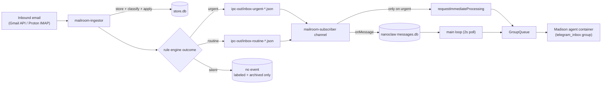

# Madison Inbox Pipeline

Push-driven delivery path from mail arrival to Madison spawning. No polling, no hourly sweeps — zero wakeups on idle days.

## Flow



## Key components

**Mailroom ingestor** — polls Gmail API + Proton bridge IMAP, stores to SQLCipher store.db, runs rule engine ([mailroom-rules.md](mailroom-rules.md)), emits events. Runs in its own Docker container; no nanoclaw restart needed to pick up rule edits (rules.json hot-reloads).

**Subscriber** at `src/channels/mailroom-subscriber.ts` — file-watcher channel on `~/containers/data/mailroom/ipc-out/`. Globs `inbox-urgent-*.json` + `inbox-routine-*.json` (legacy `inbox-new-*.json` still accepted during transition). Reads the event, stores the message via `opts.onMessage`, then for urgent only calls `opts.requestImmediateProcessing(targetJid)` to bypass the main-loop POLL_INTERVAL.

**Target group routing** at `src/inbox-routing.ts` — `findEmailTargetJid` picks the group whose `folder === EMAIL_TARGET_FOLDER` (`"telegram_inbox"`), falling back to the `isMain` group.

**requestImmediateProcessing callback** — wired in `src/index.ts`'s `channelOpts`. Urgent path skips the 2s poll by calling `queue.enqueueMessageCheck(chatJid)` directly. Routine path just stores; the main loop's next tick spawns Madison.

**Group queue** at `src/group-queue.ts` — manages per-group container lifecycle. Honors `MAX_CONCURRENT_CONTAINERS`; queues if at limit. `shutdown()` is documented as "detach, don't kill" so in-flight agents can finish on idle timeout — but in practice **stdin-attached agent containers exit with the nanoclaw process** because the spawned `docker run -i` child has its stdin pipe pinned to nanoclaw; when nanoclaw dies, stdin closes, docker run exits, and `--rm` cleans up the container. So a `systemctl --user restart nanoclaw` ends Madison's session immediately. The "detach" intent only matters for the brief window where shutdown is called but the parent process is still alive; once the parent dies, all stdin-attached containers go with it. Result: nanoclaw restart = fresh Madison on the next event, with new mount config + new CLAUDE.md (and any agent mid-conversation loses their session — comparable to a `kill -TERM` from the user's side).

**Madison container** — spawned per-need. Bind mounts (`src/container-runner.ts`):
- `~/containers/data/NanoClaw/groups/telegram_inbox/` → `/workspace/group` (RW, the CLAUDE.md lives here)
- `~/containers/data/NanoClaw/a-mem/telegram_inbox/` → `/workspace/extra/a-mem` (RW)
- `~/Documents/Obsidian/Main/NanoClaw/Inbox/` → `/workspace/extra/obsidian` (RW) — Madison reads + writes `rules.json` / `accounts.json` / `rules-changelog.md` via the `_Settings/` subfolder here. No dedicated mailroom mount on her container (an earlier attempt exposed `gmail-mcp/` OAuth creds + the encrypted store.db, which Madison doesn't need).
- Standard: `.claude/`, downloads, IPC, agent-runner source

## Prompt shape

Subscriber surfaces the rule-engine `applied` summary inline:

```
[URGENT Gmail email from DocuSign <dse@docusign.net>]
Subject: Action needed by JEFFREY STONE: Please sign your 2025 tax documents
Preview: Click to review.
Rules applied: labeled Tax

Use mcp__inbox__search, mcp__inbox__thread, or mcp__inbox__recent to read more;
mcp__inbox__apply_action / delete / send_reply / send_message to act.
```

Madison sees what rules fired without re-running the engine, so she can explain the decision or override it cleanly.

## Event delivery contract

- **Urgent** (`inbox:urgent`) — sub-second subscriber latency + immediate enqueue. Sub-minute Madison spawn from mail arrival. Stays in INBOX (conflict resolution forces `auto_archive: false` when `urgent: true`).
- **Routine** (`inbox:routine`) — subscriber latency + main-loop 2s POLL_INTERVAL + queue spawn. Few-seconds end-to-end.
- **Silent** (no event) — `auto_archive: true` + `urgent: false`. Message is labeled + archived on Gmail/Proton; Madison never spawns. Morning FYI digest can still surface it from the store if needed.

## Scheduled tasks (post-redesign)

Telegram_inbox: just the 7am morning routine. The legacy `:07` hourly triage and `*/15` auto-labeler health check were retired 2026-04-22 along with the `imap_autolabel.py` script. Backups in `~/containers/data/NanoClaw/groups/telegram_inbox/archive/`.

## Related

- [mailroom-rules.md](mailroom-rules.md) — the rule engine itself
- [../reference/rules-schema.md](../reference/rules-schema.md) — schema reference
- Madison's CLAUDE.md at `~/containers/data/NanoClaw/groups/telegram_inbox/CLAUDE.md`
- Plan: `lode/plans/active/2026-04-mail-push-redesign/tracker.md`
