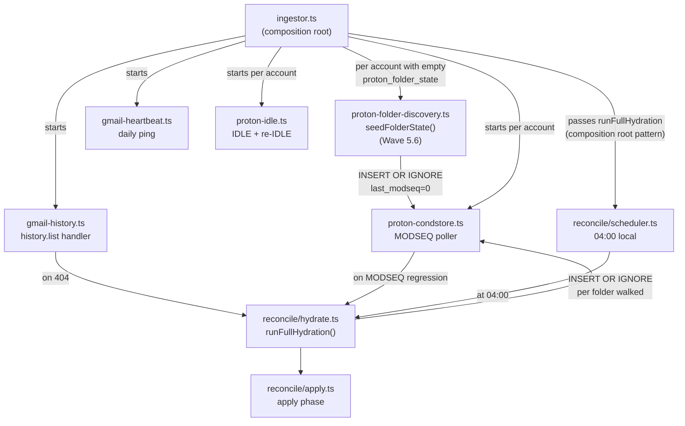
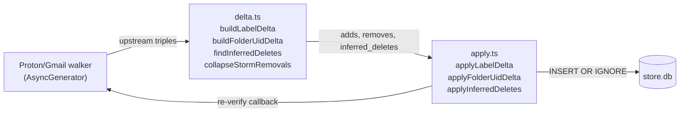

# Mailroom Mirror Sync

Sync worker architecture for keeping the SQLCipher `store.db` mirror in sync with upstream Gmail and Proton mailbox state. Part of `madison-read-power` Wave 2B. ConfigFiles commit `16886aa`.

## Gmail incremental sync

### history.list

- Per-account `users.history.list` with stored `last_history_id` on the `accounts` table.
- History pages processed in 500-event batches.
- On each page: label additions → `INSERT OR IGNORE` into `message_labels`; label removals → `DELETE WHERE`; message additions/removals update `direction`, `archived_at`, `deleted_at` columns.

### 404 handler (expiry recovery)

Gmail history tokens expire after 7 days without a request. On 404:
1. Call `runFullHydration(deps)` for the affected account.
2. Resume incremental sync with the new `historyId` returned from hydration.
3. While `runFullHydration` is unavailable (startup race), set `last_history_id = '__needs_hydration__'` sentinel; resolved on next startup.

### Daily heartbeat

`src/sync/gmail-heartbeat.ts` — issues a lightweight `history.list` call per account once per day. Advances `last_history_refresh_at`. Prevents token expiry on dormant accounts that receive no mail for >7 days.

### Label-deletion storms

When a label is deleted on Gmail, `history.list` can emit thousands of `labelsRemoved` events. Storm detection: if a single `history.list` page yields >100 removals for the same label, collapse to a single `DELETE FROM message_labels WHERE canonical = ?` bulk operation and update `label_catalog` accordingly.

## Proton incremental sync

### IDLE on INBOX

`src/sync/proton-idle.ts` — maintains an IMAP IDLE connection per Proton account against the INBOX folder:
- Re-issues IDLE command every 29 minutes (RFC 2177 timeout guidance).
- On IDLE response (EXISTS, EXPUNGE, FLAGS notifications): triggers per-folder MODSEQ check to determine what changed.

### NOOP watchdog

Every 5 minutes, sends a `NOOP` command on the IDLE connection. Timeout of 30 seconds: if NOOP doesn't return, the connection is considered dead → reconnect with exponential backoff.

### CONDSTORE MODSEQ polling

`src/sync/proton-condstore.ts` — per-folder `SELECT (CONDSTORE)` every 5 minutes. Compares `HIGHESTMODSEQ` against stored `last_modseq` in the `proton_folder_state` table.

**MODSEQ monotonicity check on reconnect:** if the new `HIGHESTMODSEQ` is less than the stored value, the Proton bridge likely restarted and reset state. Action: call `hydrateProtonFolder(account, folder, deps)` to re-walk that folder. Sets `last_modseq = -1` sentinel while hydration is pending.

**Folder-state seeding (Wave 5.6):** the set of folders polled is read from `proton_folder_state`. Seeding happens in two places:

1. **Ingestor startup** — `seedFolderState` in `src/sync/proton-folder-discovery.ts` runs once per Proton account that has zero rows in `proton_folder_state`. It executes `IMAP LIST "" "*"`, filters out `\Noselect` mailboxes, and batch-inserts a row per folder with `last_modseq=0` via `INSERT OR IGNORE`. Best-effort: IMAP failure is logged and the ingestor falls through to INBOX-only polling for that account; next restart retries.
2. **Hydration walker** — `src/reconcile/hydrate.ts` inserts a row for every folder it walks (same `INSERT OR IGNORE` pattern), so nightly reconcile self-heals any startup misses.

The `last_modseq=0` starting point is deliberate: the first CONDSTORE poll per newly-seeded folder fires for all existing messages (`UID FETCH x:* MODSEQ>0`), which invokes the Wave 5.5-hardened `applyProtonUidAdded` → writes `message_labels` + `label_catalog` + `message_folder_uids` for every message in that folder. One-time bulk-fire gap heal. After the first cycle, `last_modseq` advances to the folder's HIGHESTMODSEQ and subsequent polls are incremental.

**Deliberate non-use of `upsertFolderState`:** the seed and walker paths use `INSERT OR IGNORE` directly rather than the `upsertFolderState` helper, because that helper's `ON CONFLICT DO UPDATE SET last_modseq=excluded.last_modseq` would reset real progress back to 0 on every run.

### Event-to-DB applier

`src/sync/proton-events.ts`:
- New message in folder (`applyProtonUidAdded`) → `INSERT OR IGNORE` into `message_labels` + `label_catalog` + `message_folder_uids` (transactional).
- Message expunged from folder → `DELETE FROM message_folder_uids WHERE (message_id, folder) = ?`; if no remaining folder entries, set `deleted_at`.
- Flag change → update `direction`, `archived_at` as appropriate.

`src/sync/gmail-events.ts`:
- `applyLabelsAdded` → `INSERT OR IGNORE` into `message_labels` and `label_catalog` (catalog write added Wave 5.5 to cover first-seen labelIds).
- `applyLabelsRemoved` → `DELETE FROM message_labels WHERE (message_id, label) = ?`.
- `applyMessagesDeleted` → set `deleted_at`.

## Ingest-path label invariant (Wave 5.5)

Both legacy pollers (`src/proton/poller.ts`, `src/gmail/poller.ts`) and the Wave 2B event appliers share a single write-path contract: **whenever a row is inserted into `messages`, the corresponding `message_labels` + `label_catalog` (+ `message_folder_uids` for Proton) rows are written in the same transaction, and the per-account watermark is advanced to the message's `received_at`.**

Centralized in `src/store/ingest.ts:ingestMessage()`:

```ts
ingestMessage({
  // ... existing fields ...
  labels?: string[];                              // source-native labelIds (Gmail) or folder paths (Proton)
  folder_uid?: { folder: string; uid: number };  // Proton only
});
```

Inside the existing `db.transaction`, after the `messages` insert succeeds (`inserted === true`):
1. For each `label`: `INSERT OR IGNORE INTO label_catalog` (`canonical` from `canonicalizeLabel`, `system` derived — Gmail INBOX/SENT/DRAFT/SPAM/TRASH/UNREAD/IMPORTANT/STARRED/CATEGORY_* → 1; Proton folder paths → 0).
2. For each `label`: `INSERT OR IGNORE INTO message_labels`.
3. If `folder_uid`: `INSERT OR IGNORE INTO message_folder_uids`.
4. `UPDATE watermarks SET received_at = MAX(COALESCE(received_at, 0), ?) WHERE account_id = ?`.

Callers:
- `src/proton/poller.ts` — passes `labels: [sourceFolder]` and `folder_uid: { folder: sourceFolder, uid }`.
- `src/gmail/poller.ts` — passes `labels: msg.data.labelIds ?? []`.
- Wave 2B event appliers — `applyProtonUidAdded` and `applyLabelsAdded` write labels/catalog directly (not via `ingestMessage`, since the message row already exists).

**Why this matters**: prior to Wave 5.5, `ingestMessage` wrote only the `messages` / `threads` / `senders` / `accounts` rows and skipped labels; the migration-hydration path filled labels correctly, but new messages arriving via push ingest landed with zero label entries — Madison's INBOX-label queries silently under-counted the live inbox by ~30% on push-ingest days. The invariant makes push-ingest and hydration produce identical DB state.

### Runtime invariant tool

`mcp__messages__audit_label_coverage({since_hours?: number = 24})` — read-only MCP tool on inbox-mcp. Returns `{missing_label_count, sample_message_ids: string[]}` for messages inserted in the window that have zero `message_labels` entries. Expected: 0. Non-zero indicates the ingest-path invariant has regressed — a new write path was added that skipped `ingestMessage()` or didn't pass `labels`.

SQL:
```sql
SELECT m.message_id FROM messages m
WHERE m.source IN ('protonmail','gmail')
  AND m.deleted_at IS NULL
  AND m.received_at > ?
  AND NOT EXISTS (SELECT 1 FROM message_labels WHERE message_id = m.message_id)
LIMIT 50;
```

Madison runs this as a periodic self-check or when Jeff notices an inbox discrepancy.

## Nightly reconcile

### Schedule

`src/reconcile/scheduler.ts` — `setInterval`-based 5-minute check targeting 04:00 local time. Skips if `meta.last_reconcile_at` is within the last 20 hours (prevents double-runs after clock drift or manual trigger).

### Two-phase correctness

Phase 1 — **non-blocking read-only walk**: Proton folder walker (`src/reconcile/proton-walker.ts`) and Gmail label walker (`src/reconcile/gmail-walker.ts`) enumerate upstream state as AsyncGenerators. No writes; Madison can use the DB concurrently.

Phase 2 — **short apply transaction**: delta builder computes adds/removes vs. DB. Additions via `INSERT OR IGNORE` (idempotent). Removals re-verify the specific `(message_id, folder/label)` tuple upstream before executing `DELETE` — prevents races where a concurrent write-through already removed the entry.

### Metrics

`src/reconcile/metrics.ts` emits a JSON log line after each reconcile cycle:
```json
{
  "event": "reconcile_complete",
  "items_checked": 60166,
  "adds_applied": 0,
  "removes_applied": 0,
  "removes_skipped_reverify": 0,
  "wall_ms": 487000
}
```

## Migration orchestrator

`scripts/migrate-mirror.ts` — one-time migration that is also re-runnable as an idempotent operation. Calls `runFullHydration(deps)` — the same function used by nightly reconcile.

```
env-vault env.vault -- npx tsx scripts/migrate-mirror.ts [--dry-run]
```

**Dry-run**: walkers use `BODY.PEEK` (read-only IMAP); Gmail uses metadata-only fetch; `dryRun` flag plumbed through `runFullHydration`. No DB writes in dry-run mode.

**Self-audit on completion**: queries actual table counts, compares against reported metrics, fails `exit 1` with descriptive message on any mismatch or invariant violation. See [architecture/madison-pipeline.md](../architecture/madison-pipeline.md) for invariant list.

**Re-run awareness**: the audit fires `exit 1` on the second run for false positives (e.g. prior deleted_inferred count flagging as drift). Correct fix: compare deltas against pre-migration snapshot, not absolute counts. Tracked as deferred improvement.

## Startup wiring diagram



The scheduler and the 404 / MODSEQ-regression handlers all call the same `runFullHydration()` from `src/reconcile/hydrate.ts`. The ingestor wires the `runFn` at the composition root — the scheduler module itself does not import `hydrate.ts` directly (decoupled; testable with a stub).

## Apply path detail



## Operational notes

**env-vault prefix required** — both containers require `INBOX_DB_KEY` from env.vault. See [lode/lessons.md — Mailroom deploys must use env-vault](../lessons.md) for the full rule and the incident that documented it.

**Both containers rebuild when `src/store/` changes** — the store layer is imported by both ingestor (live polling, watermarks) and inbox-mcp (all read tools + write-through). See [lode/lessons.md — Both mailroom containers need rebuild](../lessons.md).

**btrfs snapshots at `/home/jeff/containers/data/.snapshots/mailroom/`** — hourly. `INBOX_DB_KEY` is in env.vault + password manager; snapshots are worthless without the key.

## Related

- [architecture/madison-pipeline.md](../architecture/madison-pipeline.md) — mirror data model, session-hash pattern, hydration phases
- [mailroom-rules.md](mailroom-rules.md) — rule engine + ingest pipeline
- [madison-pipeline.md](madison-pipeline.md) — push-driven event delivery to Madison
- Plan: `lode/plans/active/2026-04-madison-read-power/tracker.md`
