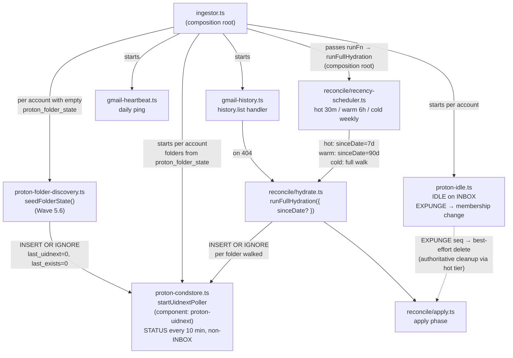
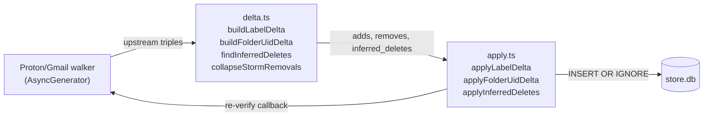

# Mailroom Mirror Sync

Sync worker architecture for keeping the SQLCipher `store.db` mirror in sync with upstream Gmail and Proton mailbox state. Originated in `madison-read-power` Wave 2B; evolved through Wave 5.5 (push-ingest parity), Wave 5.6 (folder-state seeding), Wave 5.7 (replaced CONDSTORE with UIDNEXT polling + three-tier recency reconcile, after the Proton bridge was confirmed not to advertise CONDSTORE), and Wave 5.8 (write-through correctness contract).

## Shape contract (Wave 5.8)

All three write paths to `message_labels` + `label_catalog` + `message_folder_uids` MUST produce byte-identical rows so reconcile is a no-op in steady state:

1. **Ingest** (`ingestMessage` in `src/store/ingest.ts:292-296`) — writes one row per `input.labels` entry: `label=folderPath`, `source_id=folderPath`, `canonical=canonicalizeLabel(folderPath)`, `system=0` for user labels (Proton always 0; Gmail uses `isGmailSystemLabel()`).
2. **Write-through** (helpers in `src/store/write-through.ts`) — `writeThroughAddLabel`, `writeThroughRemoveLabel`, `writeThroughSetLabels`, `writeThroughArchive`, `writeThroughDelete`. Synchronous; callers wrap with `db.transaction(...)`. Used by all MCP tool layer (`src/mcp/tools/*`) AND the rule-engine apply layer (`src/rules/apply/{proton,gmail}.ts` since Wave 5.8.6b).
3. **Reconcile apply** (`applyLabelDelta` in `src/reconcile/apply.ts:189-195`) — same column names, same canonicalization. Inverse `clearInferredDeletes` (Wave 5.8.X2) self-heals stale `deleted_inferred=1` flags when walker re-confirms a message upstream.

For Proton user labels: `label="Labels/<name>"` (with prefix). For Proton INBOX/Archive: `label="INBOX"` / `label="Archive"`. For Gmail: raw `labelId` (e.g., `INBOX`, `Label_123`, `CATEGORY_PROMOTIONS`) — Gmail INBOX IS written to `message_labels` (NOT column-only despite earlier assumption).

`writeThroughArchive` removes `label='INBOX'` from BOTH `message_labels` and `message_folder_uids`. For Proton archive, the tool layer ALSO calls `writeThroughAddLabel(db, accountId, msgId, 'Archive')` so the message has an Archive label row matching what ingest produces (per `archive.ts:263-274`).

`writeThroughSetLabels` deletes only `label LIKE 'Labels/%'` — system rows (INBOX, Archive, Sent) are intentionally preserved because Proton's label-apply is COPY (upstream membership unchanged), so stripping them would create cross-table divergence.

The shape contract is exercised by `src/integration/wave-5.8-writethrough.test.ts` (32 helper-level tests) and `src/integration/wave-5.8-reconcile-idempotency.test.ts` (4 scenarios proving reconcile is a no-op on correct write-through shape).

## Restore tool

`scripts/migrate-mirror.ts` is the authoritative full-walk restorer (used post-incident, e.g., the Wave 5.7 hot-tier blast that deleted ~190k rows). Key features (Wave 5.8.X1+X2):

- `--dry-run` computes real delta counts (adds / removes / inferred-deletes / inferred-deletes-cleared) without writing. Use this before any non-dry run on production.
- Composite index `idx_messages_account_source_message_id` (added 5.8.X1) makes the per-entry lookupMessage SEARCH instead of SCAN. Without it, a full hydration is hours; with it, ~10 min.
- `clearInferredDeletes` self-heal: when walker re-confirms a message upstream, clear its `deleted_inferred=1` and `deleted_at` flags. Reverses stale state from prior reconcile blasts.
- Self-audit phase with multiple blast guards: 50% inferred-delete absolute, label_catalog non-zero if adds reported, message_labels non-zero if Proton messages exist, per-account adds parity, reconcile_unknowns ratio. Audit failure exits non-zero with restore-from-snapshot guidance.

Run from the runtime location (`/home/jeff/containers/mailroom/`, NOT the git repo at `/home/jeff/Projects/ConfigFiles/containers/mailroom/mailroom/`) — only the runtime location's docker-compose mounts the real NAS-backed `~/containers/data/mailroom/` directory. The git repo's compose file points at a stub. Both share image tag `mailroom-local`, so build from source repo and deploy from runtime.

Recommended pre-restore: stop ingestor (`docker compose stop ingestor`), keep inbox-mcp running (Madison stays online but may briefly see intermediate state). Btrfs hourly snapshots at `~/containers/data/.snapshots/mailroom/` provide rollback.

## Gmail incremental sync

### history.list

- Per-account `users.history.list` with stored `last_history_id` on the `accounts` table.
- History pages processed in 500-event batches.
- On each page: label additions → `INSERT OR IGNORE` into `message_labels`; label removals → `DELETE WHERE`; message additions/removals update `direction`, `archived_at`, `deleted_at` columns.

### 404 handler (expiry recovery)

Gmail history tokens expire after 7 days without a request. On 404:
1. Call `runFullHydration(deps)` for the affected account.
2. Resume incremental sync with the new `historyId` returned from hydration.
3. While `runFullHydration` is unavailable (startup race), set `last_history_id = '__needs_hydration__'` sentinel; resolved on next startup.

### Daily heartbeat

`src/sync/gmail-heartbeat.ts` — issues a lightweight `history.list` call per account once per day. Advances `last_history_refresh_at`. Prevents token expiry on dormant accounts that receive no mail for >7 days.

### Label-deletion storms

When a label is deleted on Gmail, `history.list` can emit thousands of `labelsRemoved` events. Storm detection: if a single `history.list` page yields >100 removals for the same label, collapse to a single `DELETE FROM message_labels WHERE canonical = ?` bulk operation and update `label_catalog` accordingly.

## Proton incremental sync

### IDLE on INBOX

`src/sync/proton-idle.ts` — maintains an IMAP IDLE connection per Proton account against the INBOX folder:
- Re-issues IDLE command every 29 minutes (RFC 2177 timeout guidance).
- `EXISTS` notifications fire `onMailboxChange`, which triggers ingestion of new INBOX messages.
- `EXPUNGE` notifications wire directly into `applyProtonFolderMembershipChanges` with the seq number used as a best-effort UID (a no-op when seqno ≠ stored UID, which is common after any prior delete). Authoritative cleanup happens within 30 min via the hot-tier reconcile (UID SEARCH SINCE 7d) — INBOX is included in the recency walk because the UIDNEXT poller skips it. The IDLE-fired delete bounds the staleness window without claiming correctness.

### NOOP watchdog

Every 5 minutes, sends a `NOOP` command on the IDLE connection. Timeout of 30 seconds: if NOOP doesn't return, the connection is considered dead → reconnect with exponential backoff (5s base, 5min cap, double per consecutive failure).

### UIDNEXT polling

`src/sync/proton-condstore.ts` (logger component `proton-uidnext`; `startUidnextPoller`) — per-folder `STATUS (MESSAGES UIDNEXT)` every `UIDNEXT_POLL_INTERVAL_MS` (default 10 min). Tracks two cheap counters in `proton_folder_state`: `last_uidnext` (next UID the server will assign) and `last_exists` (current message count).

CONDSTORE was removed in Wave 5.7 because Proton Bridge does not advertise the capability — `HIGHESTMODSEQ` was always 0, and MODSEQ-based detection was a no-op. UIDNEXT + EXISTS gives the same change-detection signal in one round-trip without needing an extension.

Per-folder cycle (`pollFolderUidnext`):
1. `client.status(folder, { messages, uidNext })`. If both unchanged → return (hot-path no-op, no lock taken).
2. **New UIDs** (`currUidnext > prevUidnext`): take a mailbox lock, fetch `(uid, envelope)` for the range, resolve each UID's stored `rfc822_message_id` to an internal `message_id`, call `applyProtonUidAdded(messageId, folder, uid)`. First-poll case (`prevUidnext === 0`) defers to the reconcile cold walk instead of bulk-fetching — the recency scheduler will catch it.
3. **Expunges** (`currExists < prevExists`): `UID SEARCH ALL` to enumerate live UIDs, set-diff against `message_folder_uids` rows for that `(account_id, folder)`, emit `applyProtonFolderMembershipChanges` for the missing ones.
4. Upsert `last_uidnext`, `last_exists`, `last_uidnext_checked_at` regardless of which branch fired.

**INBOX is skipped** by the poller; IDLE handles INBOX EXISTS/EXPUNGE in real time, and the hot-tier reconcile sweeps INBOX as part of its 7-day window.

**Folder-state seeding (Wave 5.6):** the folder list is read from `proton_folder_state`. Seeding happens in two places:

1. **Ingestor startup** — `seedFolderState` in `src/sync/proton-folder-discovery.ts` runs once per Proton account that has zero rows in `proton_folder_state`. It executes `IMAP LIST "" "*"`, filters out `\Noselect` mailboxes, and batch-inserts one row per folder with `last_uidnext=0`, `last_exists=0` via `INSERT OR IGNORE`. Best-effort: IMAP failure is logged and the ingestor falls through to INBOX-only polling for that account; next restart retries.
2. **Hydration walker** — `src/reconcile/hydrate.ts` inserts a row for every folder it walks (same `INSERT OR IGNORE` pattern), so the recency reconcile self-heals any startup misses.

The `last_uidnext=0` sentinel triggers the deferred-first-poll path above; the first hot/cold reconcile is what actually populates the folder, then steady-state UIDNEXT polling takes over.

### Event-to-DB applier

`src/sync/proton-events.ts`:
- New message in folder (`applyProtonUidAdded`) → `INSERT OR IGNORE` into `message_labels` + `label_catalog` + `message_folder_uids` (transactional).
- Message expunged from folder → `DELETE FROM message_folder_uids WHERE (message_id, folder) = ?`; if no remaining folder entries, set `deleted_at`.
- Flag change → update `direction`, `archived_at` as appropriate.

`src/sync/gmail-events.ts`:
- `applyLabelsAdded` → `INSERT OR IGNORE` into `message_labels` and `label_catalog` (catalog write added Wave 5.5 to cover first-seen labelIds).
- `applyLabelsRemoved` → `DELETE FROM message_labels WHERE (message_id, label) = ?`.
- `applyMessagesDeleted` → set `deleted_at`.

## Ingest-path label invariant (Wave 5.5)

Both legacy pollers (`src/proton/poller.ts`, `src/gmail/poller.ts`) and the Wave 2B event appliers share a single write-path contract: **whenever a row is inserted into `messages`, the corresponding `message_labels` + `label_catalog` (+ `message_folder_uids` for Proton) rows are written in the same transaction, and the per-account watermark is advanced to the message's `received_at`.**

Centralized in `src/store/ingest.ts:ingestMessage()`:

```ts
ingestMessage({
  // ... existing fields ...
  labels?: string[];                              // source-native labelIds (Gmail) or folder paths (Proton)
  folder_uid?: { folder: string; uid: number };  // Proton only
});
```

Inside the existing `db.transaction`, after the `messages` insert succeeds (`inserted === true`):
1. For each `label`: `INSERT OR IGNORE INTO label_catalog` (`canonical` from `canonicalizeLabel`, `system` derived — Gmail INBOX/SENT/DRAFT/SPAM/TRASH/UNREAD/IMPORTANT/STARRED/CATEGORY_* → 1; Proton folder paths → 0).
2. For each `label`: `INSERT OR IGNORE INTO message_labels`.
3. If `folder_uid`: `INSERT OR IGNORE INTO message_folder_uids`.
4. `UPDATE watermarks SET received_at = MAX(COALESCE(received_at, 0), ?) WHERE account_id = ?`.

Callers:
- `src/proton/poller.ts` — passes `labels: [sourceFolder]` and `folder_uid: { folder: sourceFolder, uid }`.
- `src/gmail/poller.ts` — passes `labels: msg.data.labelIds ?? []`.
- Wave 2B event appliers — `applyProtonUidAdded` and `applyLabelsAdded` write labels/catalog directly (not via `ingestMessage`, since the message row already exists).

**Why this matters**: prior to Wave 5.5, `ingestMessage` wrote only the `messages` / `threads` / `senders` / `accounts` rows and skipped labels; the migration-hydration path filled labels correctly, but new messages arriving via push ingest landed with zero label entries — Madison's INBOX-label queries silently under-counted the live inbox by ~30% on push-ingest days. The invariant makes push-ingest and hydration produce identical DB state.

### Runtime invariant tool

`mcp__messages__audit_label_coverage({since_hours?: number = 24})` — read-only MCP tool on inbox-mcp. Returns `{missing_label_count, sample_message_ids: string[]}` for messages inserted in the window that have zero `message_labels` entries. Expected: 0. Non-zero indicates the ingest-path invariant has regressed — a new write path was added that skipped `ingestMessage()` or didn't pass `labels`.

SQL:
```sql
SELECT m.message_id FROM messages m
WHERE m.source IN ('protonmail','gmail')
  AND m.deleted_at IS NULL
  AND m.received_at > ?
  AND NOT EXISTS (SELECT 1 FROM message_labels WHERE message_id = m.message_id)
LIMIT 50;
```

Madison runs this as a periodic self-check or when Jeff notices an inbox discrepancy.

## Recency-tiered reconcile

`src/reconcile/recency-scheduler.ts` (`startRecencyReconcileScheduler`) — three cadences matched to how often state actually changes at each age:

| Tier  | Interval                | `sinceDate` window      | When                                  |
|-------|-------------------------|-------------------------|---------------------------------------|
| Hot   | every 30 min            | last 7 days             | always                                |
| Warm  | every 6 h               | last 90 days            | always                                |
| Cold  | weekly full walk        | none (everything)       | Sunday 04:00 local; checked every 5 min, skipped if last cold ran in last 6 days (`meta.last_cold_reconcile_at`) |

All three call the same `runFn({ sinceDate? })` — a thin wrapper around `runFullHydration` that the ingestor wires at the composition root. Hot/warm pass `sinceDate`; cold passes `undefined` (= full walk).

Intervals are env-configurable via `HOT_RECONCILE_INTERVAL_MS` and `WARM_RECONCILE_INTERVAL_MS`.

The legacy `src/reconcile/scheduler.ts` (single nightly 04:00 run with 20h skip window) is no longer wired up; the recency scheduler replaced it in Wave 5.7.5.

### Overlap guard

A single in-memory `reconcileRunning` flag gates all three tiers. If a hot tick fires while warm is still running, the hot run silently skips (logged at debug). Same shape as the Wave 2A.5 single-scheduler guard.

### Blast guard

Every recency run is wrapped in `runWithBlastGuard`, which snapshots `message_labels`, `message_folder_uids`, and `deleted_inferred` counts before/after. If any of these exceed a 50% delta (matching the Wave 3.5 migrate-mirror self-audit threshold), the scheduler logs an error and `process.exit(1)` to prevent compounding damage on the next tier. SQLite auto-commit means the offending writes are already on disk — recovery is via btrfs snapshot, not rollback.

### Two-phase correctness

Phase 1 — **non-blocking read-only walk**: Proton folder walker (`src/reconcile/proton-walker.ts`) and Gmail label walker (`src/reconcile/gmail-walker.ts`) enumerate upstream state as AsyncGenerators. No writes; Madison can use the DB concurrently. When `sinceDate` is set, walkers narrow their fetch (Gmail `q=after:`, Proton `UID SEARCH SINCE`) so hot/warm cycles touch only recent UIDs.

Phase 2 — **short apply transaction**: `delta.ts` computes adds/removes vs. DB. Additions via `INSERT OR IGNORE` (idempotent). Removals re-verify the specific `(message_id, folder/label)` tuple upstream before executing `DELETE` — prevents races where a concurrent write-through already removed the entry.

### Metrics

`src/reconcile/metrics.ts` emits a JSON log line after each tier:
```json
{
  "event": "reconcile_complete",
  "tier": "hot",
  "items_checked": 612,
  "adds_applied": 0,
  "removes_applied": 0,
  "removes_skipped_reverify": 0,
  "wall_ms": 14200
}
```

## Migration orchestrator

`scripts/migrate-mirror.ts` — one-time migration that is also re-runnable as an idempotent operation. Calls `runFullHydration(deps)` — the same function used by nightly reconcile.

```
env-vault env.vault -- npx tsx scripts/migrate-mirror.ts [--dry-run]
```

**Dry-run**: walkers use `BODY.PEEK` (read-only IMAP); Gmail uses metadata-only fetch; `dryRun` flag plumbed through `runFullHydration`. No DB writes in dry-run mode.

**Self-audit on completion**: queries actual table counts, compares against reported metrics, fails `exit 1` with descriptive message on any mismatch or invariant violation. See [architecture/madison-pipeline.md](../architecture/madison-pipeline.md) for invariant list.

**Re-run awareness**: the audit fires `exit 1` on the second run for false positives (e.g. prior deleted_inferred count flagging as drift). Correct fix: compare deltas against pre-migration snapshot, not absolute counts. Tracked as deferred improvement.

## Startup wiring diagram



All three recency tiers and the Gmail 404 handler call the same `runFullHydration()` from `src/reconcile/hydrate.ts`. The ingestor wires the `runFn` at the composition root — the scheduler module itself does not import `hydrate.ts` directly (decoupled; testable with a stub).

## Apply path detail



## Operational notes

**env-vault prefix required** — both containers require `INBOX_DB_KEY` from env.vault. See [lode/lessons.md — Mailroom deploys must use env-vault](../lessons.md) for the full rule and the incident that documented it.

**Both containers rebuild when `src/store/` changes** — the store layer is imported by both ingestor (live polling, watermarks) and inbox-mcp (all read tools + write-through). See [lode/lessons.md — Both mailroom containers need rebuild](../lessons.md).

**btrfs snapshots at `/home/jeff/containers/data/.snapshots/mailroom/`** — hourly. `INBOX_DB_KEY` is in env.vault + password manager; snapshots are worthless without the key.

## Related

- [architecture/madison-pipeline.md](../architecture/madison-pipeline.md) — mirror data model, session-hash pattern, hydration phases
- [mailroom-rules.md](mailroom-rules.md) — rule engine + ingest pipeline
- [madison-pipeline.md](madison-pipeline.md) — push-driven event delivery to Madison
- Plan: `lode/plans/active/2026-04-madison-read-power/tracker.md`
